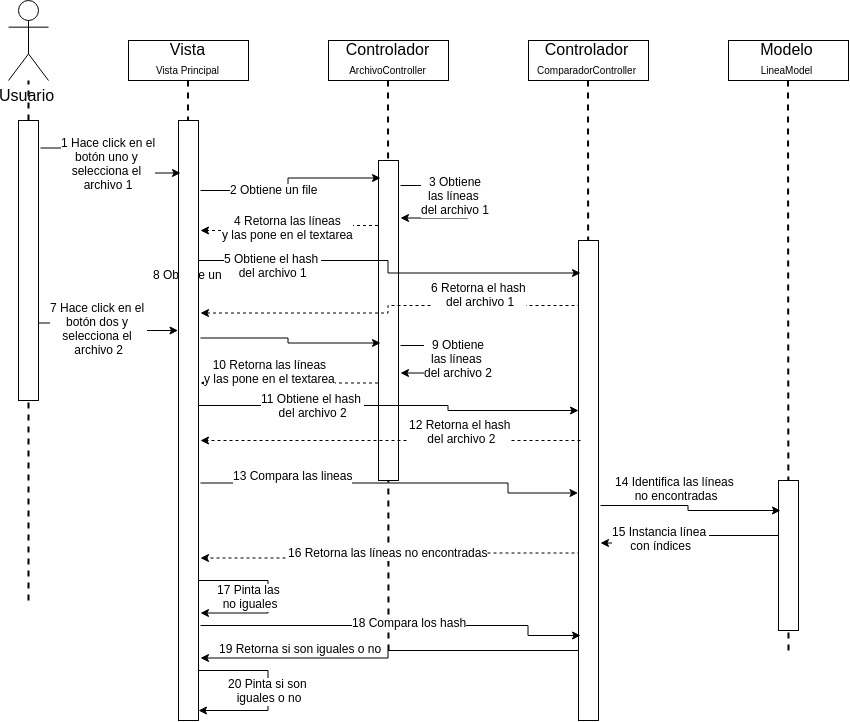

# ComparadorTexto
Se comparan dos archivos de texto línea a línea
## Controllers
### ComparadorFrame:
- Se marca en el segundo textarea las líenas de texto que difieren del segundo
### ComparadorController
- Contiene las funciones de comparación línea a línea
### ArchivoController
- Abre un archivo de texto y retorna un String con el contenido
## Models
### Linea
- Pojo para transportar el inicio y fin de una línea

## Diagrama de Secuencia
 

## Diagrama de proceso
 

## Herramientas
- Netbeans
- Java 8
- MVN